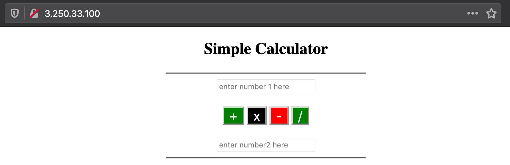
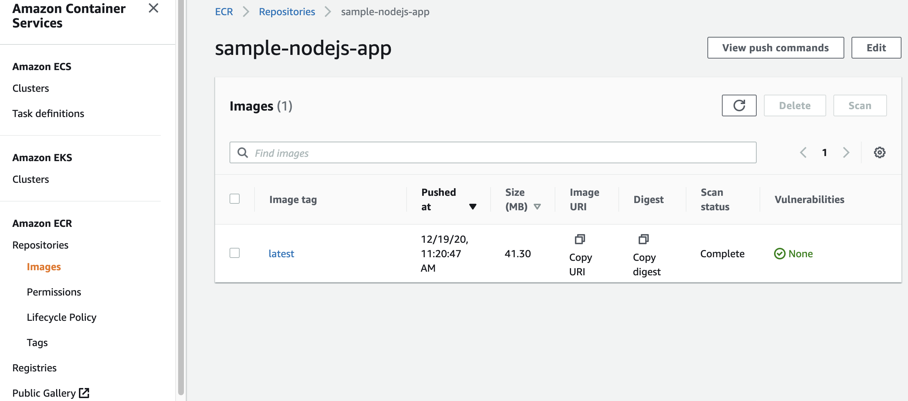
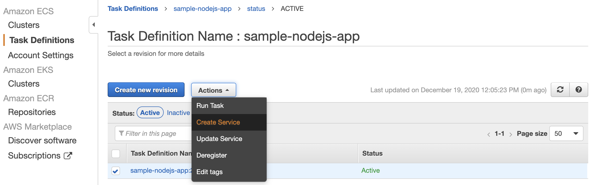
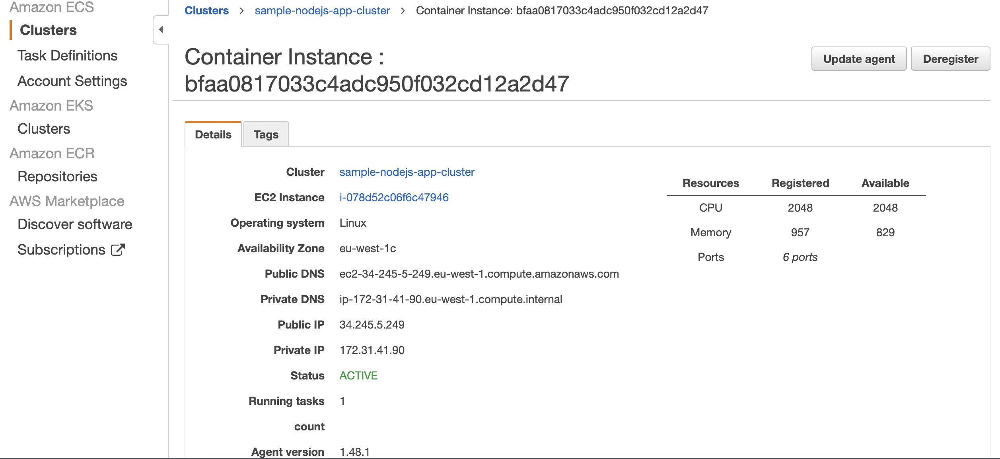

# How to Deploy a Node-Express App on Amazon ECS

The purpose of this repository is to demonstrate how to deploy a simple web application built by Express - Node.js web application framework on Amazon ECS by using Amazon ECR (Elastic Container Registry)

## Requirements

 - Dockerfile and the sample code are provided in this repository.
 - In the optional part 1, we'll [install Docker on AWS EC2](https://docs.aws.amazon.com/AmazonECS/latest/userguide/docker-basics.html#install_docker), build and run the image. You might also use local development environment for this part.
 - In the optional part 2, we'll push the image to [Amazon ECR](https://docs.aws.amazon.com/AmazonECR/latest/userguide/getting-started-cli.html#cli-authenticate-registry)


## Part 1 - Optional : Running Docker on Amazon EC2

Launching an EC2 instance with Amazon Linux 2.`t3.micro` size is sufficient for the sake of this demosntration and since we'll use `port 80` for web application, Security Group allow HTTP protocol at this port. Once your instance is up and running, SSH into it and Run the commands below on your instance :

```bash
# Install Docker
$ sudo amazon-linux-extras install docker
$ sudo service docker start
# to restart at every reboot
$ sudo chkconfig docker on
# adding the ec2-user to the docker
$ sudo usermod -a -G docker ec2-user
$ sudo reboot
# to verify
$ docker info
```

**Note :** In some cases, you may need to reboot your instance to provide permissions for the ec2-user to access the Docker daemon. Try rebooting your instance in that case.

```bash
# install git
$ sudo yum install -y git
$ git clone https://github.com/aws-samples/amazon-ecs-demo-with-node-express
# build docker image
$ cd amazon-ecs-demo-with-node-express/sample-nodejs-app
$ docker build -t sample-nodejs-app .
# verify and get the image id
$ docker images
# run docker image
$ docker run --name dockerized-node-app -p 80:3000 --init --rm sample-nodejs-app

```

Congratulations! Now, you've deployed a containerized Express - Node.js web app on Amazon EC2. Visit to public DNS of your instance to see the application.

Note: Don't forget to clean your resources to prevent any unexpected charge. 

<p align="center">
    
<p>

## Part 2 - Optional : Push an image to Amazon ECR

In this part we will the image to a container registry - Amazon ECR in order to use it in an Amazon ECS task definition. We'll proceed with a private repository in this demo, but public repositories and Docker Hub are also supported.

```bash
# Authenticate to your default registry
# update the region and aws_account_id on the below command
$ aws ecr get-login-password --region <region> | docker login --username AWS --password-stdin <aws_account_id>.dkr.ecr.<region>.amazonaws.com

# Once you receive 'Login Succeeded" , you can create your private repo on ECR
# update the region on the below command
$ aws ecr create-repository \
    --repository-name sample-nodejs-app \
    --image-scanning-configuration scanOnPush=true \
    --region eu-west-1

# tag and push your image
# update the region and aws_account_id on the below command
$ docker tag sample-nodejs-app:latest <aws_account_id>.dkr.ecr.<region>.amazonaws.com/sample-nodejs-app:latest

$ docker push <aws_account_id>.dkr.ecr.<region>.amazonaws.com/sample-nodejs-app:latest

```

Congratulations! Now, you've pushed this image to a private repository of Amazon ECR. This should now be listed on your Images under Amazon ECR repositories. Copy the Image URI as we'll need it in the next step.

<p align="center">
    
<p>

## Part 3 - Deploying the application on Amazon ECS

### 1. Create a Task Definition from the ECS dashboard:

[A task definition](https://docs.aws.amazon.com/AmazonECS/latest/developerguide/task_definitions.html) is required to run Docker containers in Amazon ECS to specify parameters such as "The Docker image to use with each container in your task", "How much CPU and memory to use with each task","The launch type to use", "The Docker networking mode to use for the containers in your task" ...

- **Launch type:** ec2
- **Task Definition Name:** sample-nodejs-app
- **Click "Add Container"** under Container Definitions
  - **Container name:** sample-nodejs-app
  - **Image:**'aws_account_id'.dkr.ecr.'region'.amazonaws.com/sample-nodejs-app:latest
  - **Soft limit:** 256
  - **Port Mapping:** 80(host):3000(container)
  - You might leave other settings as default and click add.

- You might leave other settings as default and click create

You should now be able to see your task definition on the console.

### 2. Create Cluster from ECS dashboard:

[An Amazon ECS cluster](https://docs.aws.amazon.com/AmazonECS/latest/developerguide/clusters.html) is a logical grouping of tasks or services. If you are running tasks or services that use the EC2 launch type, a cluster is also a grouping of container instances.

- **Cluster Template:** EC2 Linux + Networking

- **Cluster Name :** sample-nodejs-app-cluster

- **EC2 instance type:** t3.micro

- **Number of instances:** 1
- **Root EBS Volume Size:** 30 GiB
- **VPC/Subnet/Security group:** You can choose from the existing once but make sure your instance is in a public subnet and HTTP protocol on port 80 is allowed

- You might leave other settings as default and click create

You should now be able to see your cluster details on the dashboard.

### 3. Create Amazon ECS Service :

[An Amazon ECS service](https://docs.aws.amazon.com/AmazonECS/latest/developerguide/ecs_services.html) enables you to run and maintain a specified number of instances of a task definition simultaneously in an Amazon ECS cluster.

<p align="center">
    
<p>

- **Launch type: EC2
- Service name: sample-nodejs-app-service
- Number of tasks: 1

- You might leave other settings as default, proceed through the next steps and click `Create Service`

Congratulations! Now, you've deployed a Express - Node.js web app on Amazon ECS by using an image from ECR. Visit to public DNS of the instance from your cluster to see the application.

<p align="center">
    
<p>

Note: Don't forget to clean your resources to prevent any unexpected charge. 

## Security

See [CONTRIBUTING](CONTRIBUTING.md#security-issue-notifications) for more information.

## License

This library is licensed under the MIT-0 License. See the LICENSE file.
